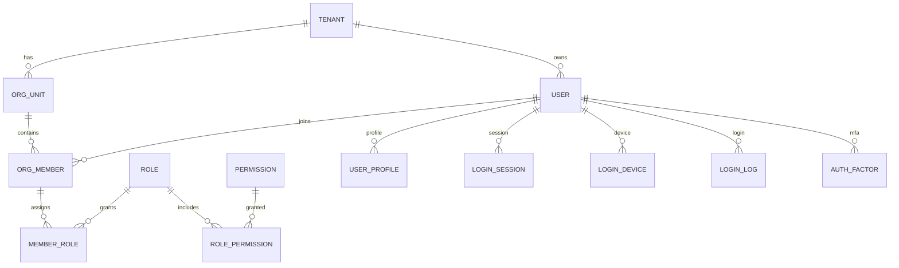

# 企业级用户体系表结构设计（草案）

> 目标：在现有 `account` / `ad_user` 基础上，补齐多租户、组织、权限、认证与审计能力。

## 1. 设计原则
- 多租户隔离（数据、权限、配置）。
- 统一身份模型（管理员/业务用户同一身份体系）。
- 权限可扩展（资源 + 动作 + 范围）。
- 审计可追溯（登录、授权、操作记录）。

## 2. 核心表（建议字段）

### 2.1 租户与组织
- `tenant`
  - `id`, `code`, `name`, `status`, `owner_user_id`, `create_time`, `update_time`
- `org_unit`
  - `id`, `tenant_id`, `parent_id`, `name`, `code`, `sort_order`, `status`
- `org_member`
  - `id`, `tenant_id`, `user_id`, `org_unit_id`, `member_type`, `status`, `join_time`
- `member_role`
  - `id`, `tenant_id`, `member_id`, `role_id`

### 2.2 统一身份与档案
- `user`
  - `id`, `tenant_id`, `username`, `password`, `status`, `phone`, `email`, `user_type`
- `user_profile`
  - `id`, `user_id`, `real_name`, `avatar`, `company_name`, `tax_number`, `credit_code`

### 2.3 权限与资源
- `role`
  - `id`, `tenant_id`, `code`, `name`, `status`, `remark`
- `permission`
  - `id`, `tenant_id`, `code`, `name`, `type`, `resource`, `action`, `scope`, `parent_id`
- `role_permission`
  - `id`, `tenant_id`, `role_id`, `permission_id`

### 2.4 认证与审计
- `login_session`
  - `id`, `user_id`, `token`, `expired_at`, `status`, `device_id`
- `login_device`
  - `id`, `user_id`, `device_fingerprint`, `device_name`, `last_login_time`, `status`
- `login_log`
  - `id`, `user_id`, `ip`, `user_agent`, `login_time`, `result`, `reason`
- `auth_factor`
  - `id`, `user_id`, `type`, `secret`, `status`

## 3. ERD（示意）

## 4. 与现有系统的映射建议
- 将 `account` 与 `ad_user` 统一到 `user` 表，以 `user_type` 区分（ADMIN / BIZ）。
- 保留现有 `Account` 业务字段下沉到 `user_profile`（或 `account_profile`）表。
- 逐步替换 `ad_role / ad_permission` 为统一 `role / permission`。

## 5. 字段规范
- 主键：`id` 使用 UUID / 雪花 ID。
- 审计字段：`create_time`, `update_time`, `create_by`, `update_by`。
- 软删除：`is_deleted`（如需）。
- 索引：`code` / `username` / `phone` / `tenant_id` 必须建立索引。
